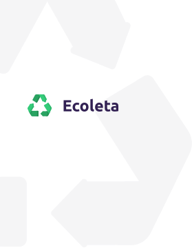

<h1 align="center"> 
	🚀 NextLevelWeek :: RocketSeat
</h1>
<h4 align="center"> By Inácio Régis - using Node.js, React, React Native, Expo </h4>
 

 

 

## ♻️ Project 

Ecoleta is a project developed based on international environment week. 
That aims to connect people to companies that collect specific waste such as light bulbs, batteries, cooking oil, etc.

<h2 align="center">
    
</h2>

## 🎴 Layout
To access the layout use [Figma](https://www.figma.com/file/1SxgOMojOB2zYT0Mdk28lB/).

## 📝 License

This project is under the MIT license. See the [LICENSE](LICENSE.md) for details.

Made with ♥ by Inácio Régis 🔗 [Linkedin!](https://www.linkedin.com/in/inacioregis/)

[nodejs]: https://nodejs.org/
[typescript]: https://www.typescriptlang.org/
[expo]: https://expo.io/
[reactjs]: https://reactjs.org
[rn]: https://facebook.github.io/react-native/
[vs]: https://code.visualstudio.com/
